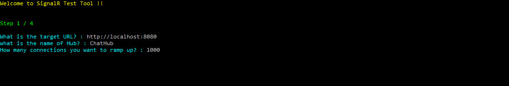
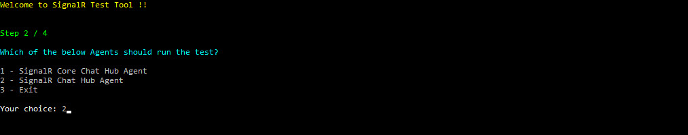
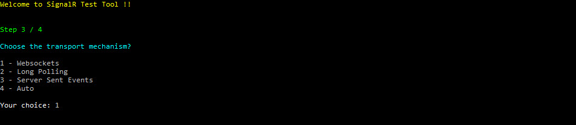
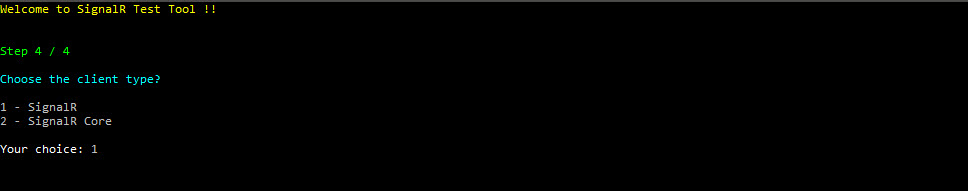
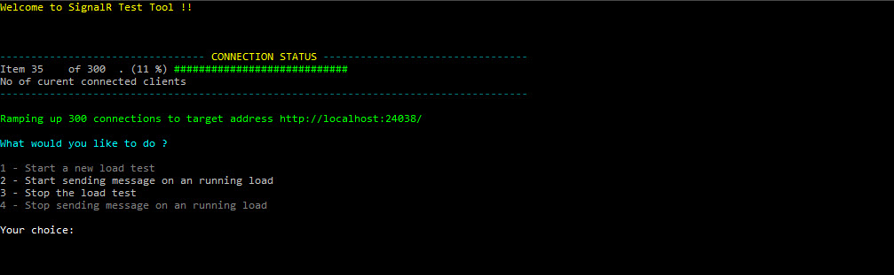
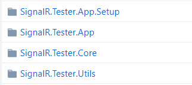
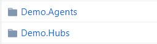

# signalr-tester
[](https://github.com/emtecinc/signalr-tester/blob/master/LICENSE)
### A tool for testing Asp.Net SignalR and Asp.Net Core SignalR api's

### Summary
#
This tool is a console based application for testing **SignalR Hub**, and supports hub created using **Asp.Net SignalR** and **Asp.Net Core SignalR**. You can create your own test setup as DLL, drop it in to a secific directory of the tool, and you are done!! Tool will do the rest for you. 

Currently it supports following features:

1. Creating a connection with Hub.
2. Ability to choose transport mechanism i.e. Websockets, SSE, Long Polling or Auto.
3. Ability to hook up a startup method which will be called immediately after a successful connection is established with the Hub.
4. Ability to hook up other methods which can be called at a later stage, once the connection is established. It can be used to stress out the connection.
5. Ability to write any dotnet code for complex test setup scenarios.

**PreRequisite** - **.Net Framework 4.6.1**

### What options do you have?
#

When it comes to testing **`SignalR Hub`**, unfortunately there aren't much tools available around. 

Following are some of the tools available, which you can use:

1. [Crank](https://docs.microsoft.com/en-us/aspnet/signalr/overview/performance/signalr-connection-density-testing-with-crank)

    This tool is from microsoft and comes as part of [SignalR code base](https://github.com/signalr/signalr). You can use this tool to find out the number of simultaneous TCP connections that can be established on a server, which is also known as Connection Density.

2. [Tresi (Commercial)](http://www.wcfstorm.com/wcf/tresiproduct.aspx)

    This is a commercial product which allows you to test wcf and SignalR services.

### What is so different in this [tool](https://github.com/emtecinc/signalr-tester) !!
#

As a matter of fact, none of the tools above actually gives you a provision to setup your test case using `C#` as the authoring language and does not cater for some of the complex setup needs, which you might come across. Also, none of them have support for both Asp.Net SignalR and Asp.Net Core SignalR.

Let's go through few examples to understand better, what you can do in a `test setup`.

**Example 1 (Simple Setup)**:

Let's say you have a Hub as shown below. You want to execute the `LogOn` function, once a connection with Hub is established.

```cs

public class ChatHub : Hub
    {
        private readonly object _lockAtom = new object();

        public void LogOn(string name)
        {
            Clients.All.onlogOn(name);
        }

        public void Send(string name, string message)
        {
            Clients.All.broadcastMessage(name, message);
        }

        public override Task OnConnected()
        {
            lock (_lockAtom)
                PerformanceCounter.WebsocketCount++;

            return base.OnConnected();
        }

        public override Task OnDisconnected(bool stopCalled)
        {
            lock (_lockAtom)
            {
                if (PerformanceCounter.WebsocketCount > 0)
                    PerformanceCounter.WebsocketCount--;
            }

            return base.OnDisconnected(stopCalled);
        }
    }

```
#

**Example 2 (Complex Setup)**:

Let's say you have a Hub as shown below. You want to execute the `LogOn` function, once a connection with Hub is established. 

However, in this test setup, you also want to achieve following things:

1. A random guid should be passed as parameter to LogOn function, and the same guid should be stored in a list for future use.

2. When, the Send function is called, a random guid should be picked up from the above list, and the same should be passed as first parameter to Send, and second parameter being again a random message.

```cs

public class ChatHub : Hub
    {
        private readonly object _lockAtom = new object();

        public void LogOn(string name)
        {
            Clients.All.onlogOn(name);
        }

        public void Send(string name, string message)
        {
            Clients.All.broadcastMessage(name, message);
        }

        public override Task OnConnected()
        {
            lock (_lockAtom)
                PerformanceCounter.WebsocketCount++;

            return base.OnConnected();
        }

        public override Task OnDisconnected(bool stopCalled)
        {
            lock (_lockAtom)
            {
                if (PerformanceCounter.WebsocketCount > 0)
                    PerformanceCounter.WebsocketCount--;
            }

            return base.OnDisconnected(stopCalled);
        }
    }

```
**Well, if you have such setup needs then you have come to the right place !!**

Please follow along the article below to know how to use the tool.

### Usage
#

**Step 1**: Download the Tool and install

Download the latest MSI from [Releases](https://github.com/emtecinc/signalr-tester/releases).   Just run it and install. It will place a shortcut on the desktop and start menu.

**Step 2**: Create an Agent.

You need to have `C#` programming knowledge to create an Agent. Read [How to build an agent](https://github.com/emtecinc/signalr-tester#how-to-build-an-agent) section below for the same.

**Step 3**: Copy the agent

Once you create an agent and you are ready with the `dll`, copy the same to `Agents` folder in the installation directory of the tool.

**Step 4**: Run the tool

Run the `SignalR Tester` tool from start menu or Desktop. The tool will guide you through a wizard, just following along and you will be able to test you Hub.

**NOTE** - **A `Default Agent` comes pre-installed out of box, which can only ramp up connections to Hub.**

### Tool Screenshots
#

Options Page


Step 1 Page



Step 2 Page



Step 3 Page



Step 4 Page



Connections Ramp Up



### How to build an agent
#

**Step 1**: Create a C# Class Library (.Net Framework) project

Create a class library using the standard `C# Class Library (.Net Framework)` project template. You can choose any name for the project.

**Step 2**: Add reference to the core library

Add a reference to `SignalR.Tester.Core.dll` in this project. You will find this dll in the installation directory of the tool.

**Step 3**: Create a class

Create a class. You can name it anything, but it should fulfill the below requirements.

* It should inherit from `AgentBase` which is an abstract class.
    
    AgentBase is available in `SignalR.Tester.Core.Agents` namespace of `SignalR.Tester.Core.dll` dll. It provides the core functionality of an agent.

* Class should be decorated with below attributes. 

    `PartCreationPolicy`,`Export` & `ExportMetadata` attributes are available in `System.ComponentModel.Composition` namespace of `System.ComponentModel.Composition.dll` dll. 

    Choose an appropriate `AgentName` & `AgentDescription`. Whatever `AgentName` you choose, the same will be available in the second page of the wizard, when you run the tool.
    
```cs
  [PartCreationPolicy(CreationPolicy.NonShared)]
  [Export(typeof(IAgent))]
  [ExportMetadata("AgentName", "SignalR Chat Hub Agent")]
  [ExportMetadata("AgentDescription", "Agent for testing microsoft sample ChatHub")]
```

* Mark the constructor with `ImportingConstructor`
* Override the functions `MethodToInvokeOnAgentStarted` and `PreRegisterMethods`

    `MethodToInvokeOnAgentStarted` is used to register the methods which you want to **invoke immediately** after the connection with SignalR server is established. If you don't want to execute any function then just return null.

    `PreRegisterMethods` is used to register the methods which you want to invoke at a **later stage**, after the connection with SignalR server is established. This, will be usually used when you want to stress out the connection, by calling a function regularly at certain interval. If you don't want to register any method then just return null.


**Step 4**: Build the library

**Step 5**: **Copy the output dll (dll which matches with the assembly name of the class library) to `Agents` directory in the installation directory of the tool, which will be mostly `C:\Program Files (x86)\Emtecinc\SignalR.Tester\Agents`. Also, if there are any 3rd party nuget packages used, then those dll's should also be copied.**

### Agent Examples
#
A full-blown agent for Example 2, explained above will look like below.

```cs

using SignalR.Tester.Core;
using SignalR.Tester.Core.Agents;
using System;
using System.Collections.Generic;
using System.ComponentModel.Composition;
using System.Text;
using System.Threading.Tasks;

namespace your.namespace
{
    [PartCreationPolicy(CreationPolicy.NonShared)]
    [Export(typeof(IAgent))]
    [ExportMetadata("AgentName", "SignalR Chat Hub Agent")]
    [ExportMetadata("AgentDescription", "Agent for testing microsoft sample ChatHub")]

    public class ChatHubAgent : AgentBase
    {
        List<string> RandomUsers;

        [ImportingConstructor]
        public ChatHubAgent(Recomposable<ConnectionArgument> arguments) : base(arguments)
        {
            RandomUsers = new List<string>();
        }

        protected override Tuple<string, Func<string, Task<object[]>>> MethodToInvokeOnAgentStarted()
        {
            return new Tuple<string, Func<string, Task<object[]>>>("LogOn", LogOn);
        }

        protected override List<Tuple<string, Func<string, Task<object[]>>>> PreRegisterMethods()
        {
            List<Tuple<string, Func<string, Task<object[]>>>> methods = new List<Tuple<string, Func<string, Task<object[]>>>>
            {
                new Tuple<string, Func<string, Task<object[]>>>("Send", Send)
            };

            return methods;
        }

        private Task<object[]> LogOn(string data)
        {
            //Create a new guid, and store it in a list
            var randomUser = Guid.NewGuid().ToString();
            RandomUsers.Add(randomUser);
            return Task.FromResult(new object[] { randomUser });
        }

        private Task<object[]> Send(string data)
        {
            //pick up a random user from list
            Random rnd = new Random();
            var randomPosition = rnd.Next(0, RandomUsers.Count - 1);
            var randomUser = RandomUsers[randomPosition];
            return Task.FromResult(new object[] { randomUser, RandomString(10, true) });
        }

        private string RandomString(int size, bool lowerCase)
        {
            var builder = new StringBuilder();
            var random = new Random();
            char ch;
            for (int i = 0; i < size; i++)
            {
                ch = Convert.ToChar(Convert.ToInt32(Math.Floor(26 * random.NextDouble() + 65)));
                builder.Append(ch);
            }
            if (lowerCase)
                return builder.ToString().ToLower();
            return builder.ToString();
        }
    }
}
```
A **barebones agent**, with which you can just ramp up connections. It won't be able able to execute any method after connection is established, nor you will be able to execute a method at later stage, since you are returning null from `MethodToInvokeOnAgentStarted` & `PreRegisterMethods` respectively.

```cs
using SignalR.Tester.Core;
using SignalR.Tester.Core.Agents;
using System;
using System.Collections.Generic;
using System.ComponentModel.Composition;
using System.Threading.Tasks;

namespace Test.Agent
{
    [PartCreationPolicy(CreationPolicy.NonShared)]
    [Export(typeof(IAgent))]
    [ExportMetadata("AgentName", "Test Agent")]
    [ExportMetadata("AgentDescription", "Test Agent")]
    public class TestAgent : AgentBase
    {
        [ImportingConstructor]
        public TestAgent(Recomposable<ConnectionArgument> arguments) : base(arguments)
        {
        }

        protected override Tuple<string, Func<string, Task<object[]>>> MethodToInvokeOnAgentStarted()
        {
            return null;
        }

        protected override List<Tuple<string, Func<string, Task<object[]>>>> PreRegisterMethods()
        {
            return null;
        }
    }
}
```

You can do whatever you want in the agent ex. DB calls, Api integration, File access etc. Possibility is endless.

You can create as many classes you want in a class library project for testing out different scenarios, or you can create separate library projects for each of the different scenarios. It is up to you, how you want to structure it.

### Developer
#

From developer perspective below are the core projects:



**SignalR.Tester.App** is the **Startup** project

#
Sample Agents and Hubs are included in below folders:



Please do send us a PR if you have any ideas and you want to contribute further in extending the tool.

**Happy Testing !!**


